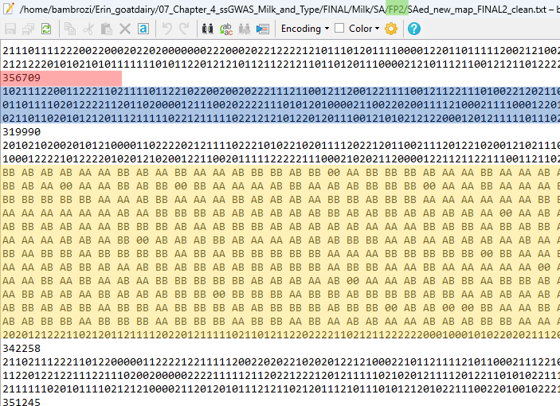
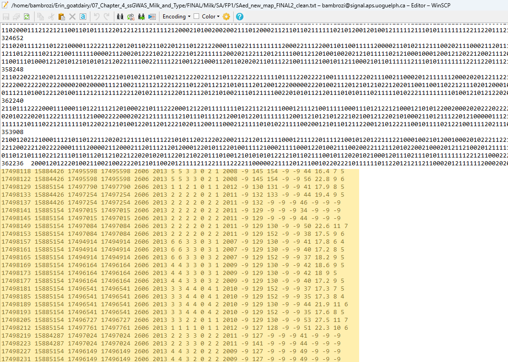
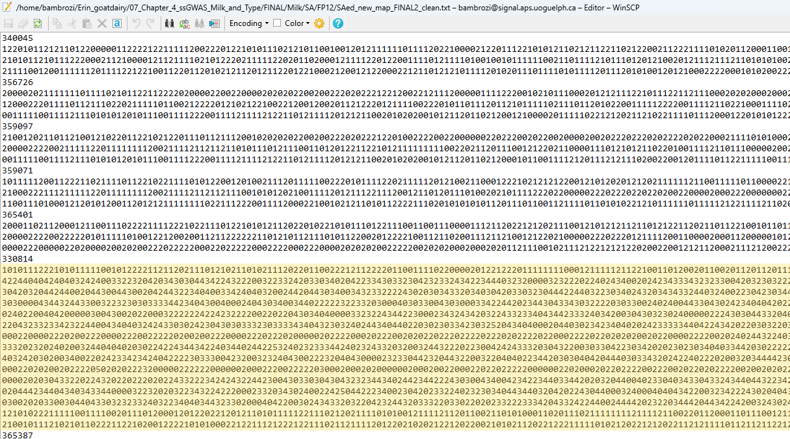
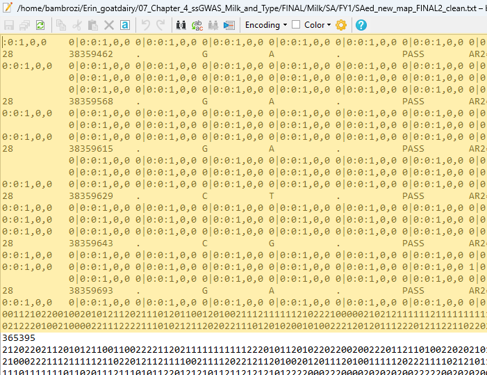
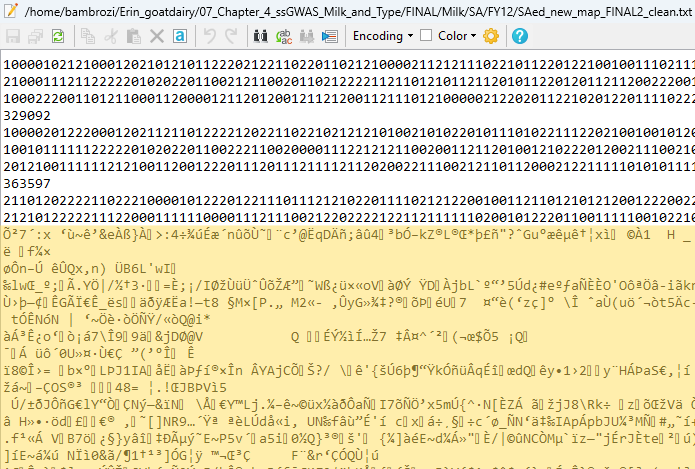
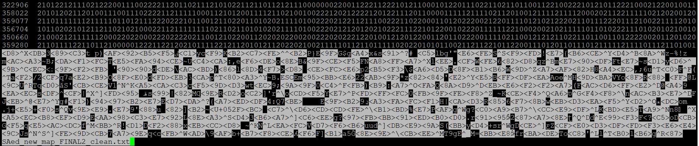
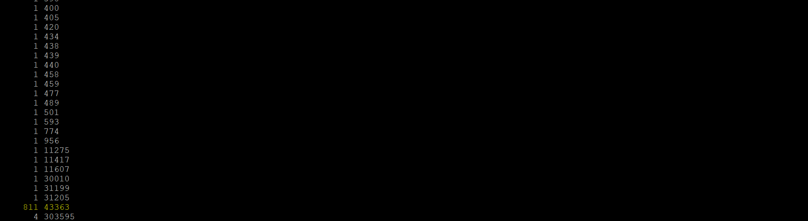
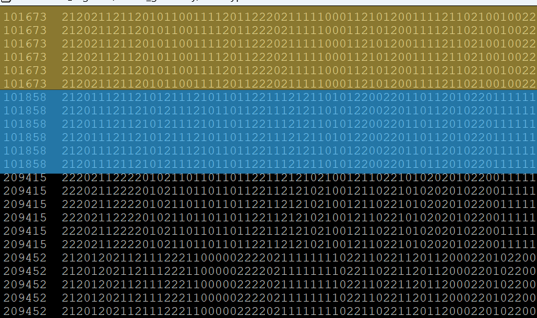
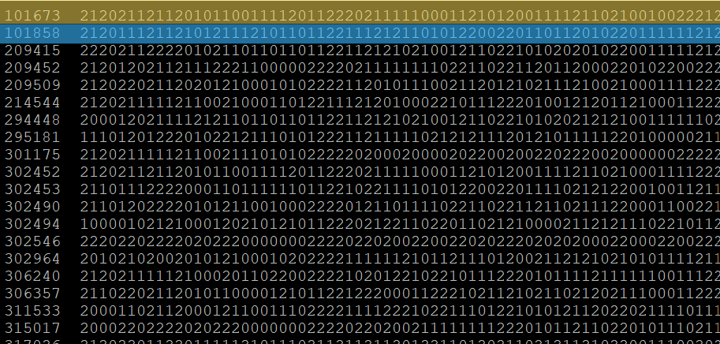

In  this tutorial you will find some basic linux commands to use on command line.

# Problem 01

I discovered that my genotype file were corrupted. At least I had several copies of the same file stored in different sub directories. These different copies had the files corrupted in different points.




In the file above you can check the directory in which this copy is stored (<span style="background-color: lightgreen;">highlighted green area</span>), the <span style="background-color: yellow;">yellow highlighted area</span> is the corruption, the <span style="background-color: lightcoral;">red highlighted area</span> is individual (or sample) name, the <span style="background-color:lightblue;">blue area</span> is the correct 43.363 correct SNPs.

Bellow you can find four more copies from the same file, but in different subdirectories and also corrupted.


**Subdirectory FP1**



**Subdirectory FP12**



**Subdirectory FY1**



**Subdirectory FY12**



How could we solve this problem?

## Checking the corruption

```{bash eval=FALSE}
less -S SAed_new_map_FINAL2_clean.txt
```

With the command above we are going to show the file and do not brok the lines, in other words each row will be showed as a unique line.

In the outcome, a line with no corruption need to have the first "column" ($1) showing the individual, and the second "column" ($2) showing the SNP.



## Checking the amount of lines no corrupted

Lets perform this checking the lenght of the second element or column

```{bash eval=FALSE}
awk '{print length($2)}' SAed_new_map_FINAL2_clean.txt | sort -n | uniq -c
```

<style>
ul {
  list-style: disc;
}
</style>

- **awk**: Awk is a text processing tool that processes text files line by line

- **'{print length($2)}'**: This is an Awk script enclosed in single quotes. It instructs Awk to print the length of the second field ($2) on each line of the input file.

- **SAed_new_map_FINAL2_clean.txt**: This is the input file that Awk processes.

- **|**: This is a pipe symbol that takes the output of the command on its left and uses it as the input for the command on its right.

- **sort**: This command sorts lines of text.
- **-n**: This option tells sort to perform a numerical sort. This means it will sort the lengths of the second fields as numbers rather than as strings

- **uniq**: This command is used to filter out repeated lines from a sorted file

- **-c**: This option tells uniq to prefix each line with the count of how many times it occurs. In this context, uniq -c will count how many times each unique length of the second field appears in the sorted list of lengths.

So, in summary, the entire command processes the SAed_new_map_FINAL2_clean.txt file, calculates the length of the second field on each line, sorts these lengths numerically, and then counts the occurrences of each unique length, providing a frequency distribution of the second field lengths in the file. The output will show each length along with the number of times it appears in the file.



As one can see in the imabe above we found 811 times the length of 43,363 SNP inside our genotype files, but we also found once a line with 31,205 and four times a line with 303,595, these two last examples are corrupted lines.

Now we know that we have 811 samples or individuals no corrupted.

## Creating a file only with no corrupted individuals.

We know that the correct number of SNPs in this file is 43,363 bp, and we discovere that we have 811 no corrupted individuals, now we could create a new files without corrupted individuals. To do this we will use the command bellow:
```{bash eval=FALSE}
awk 'length ($2) ==43363' SAed_new_map_FINAL2_clean.txt > corrup_ind_rmv.txt
```

Note that this command will extract from the input file, in this instance, *SAed_new_map_FINAL2_clean.txt* and create a new file called *corrup_ind_rmv.txt*. In this command line the input file and output file are in the same directory, otherwise one should add the path, for instance: */home/bambrozi/corrup_ind_rmv.txt*

Now we have one file only with 811 no corrupted file.

You should do the same with other copies of the same file stored in different subdirectories, you will see that different copies probably will have different rows corrupted and therefore probably have some of your previous corrupted line incorrupt.

## Merging, sorting and creating a new file.

Now probably you have a bunch of different files, all of them with different number of incorrupt lines.

The first step is to merge all these files in one sole file.
```{bash eval=FALSE}
cat corrup_ind_rmv1.txt corrup_ind_rmv2.txt corrup_ind_rmv3.txt > combined.txt
```

The second step is to sort the combined files
```{bash eval=FALSE}
sort combined.txt > sorted_combined.txt
```

The outcome file will have the same number repeated some times for the first element (column). This is because in the original files, we had the same individual or sample incorrupt in different copies.



The last step is remove duplicate rows
```{bash eval=FALSE}
uniq sorted_combined.txt > final_combied.txt
```

Compare the individuals (samples) <span style="background-color: yellow;">101673</span> and <span style="background-color:lightblue;">101858</span> between the images above and bellow, you will see that the duplications were removed.

 


